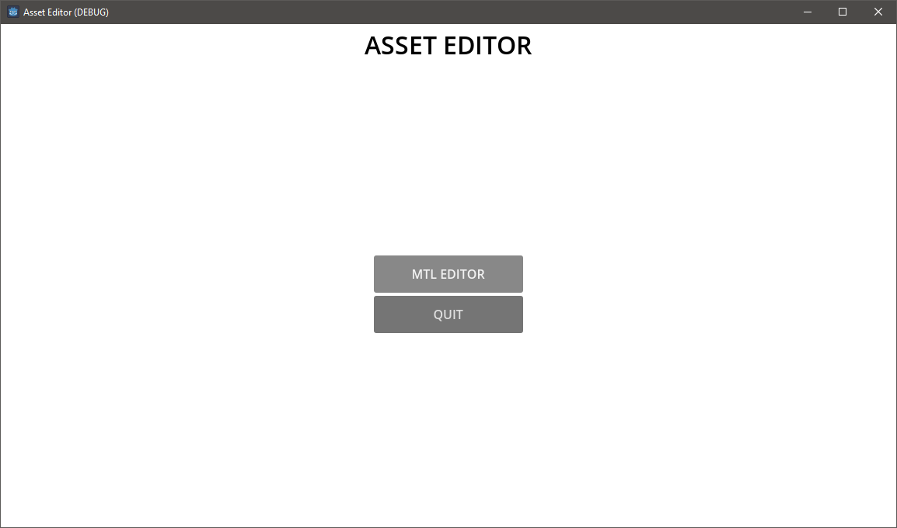
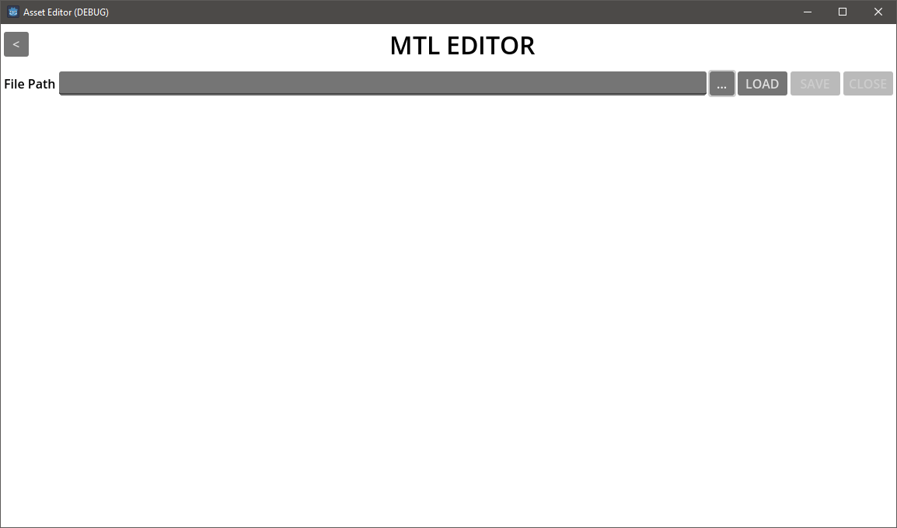
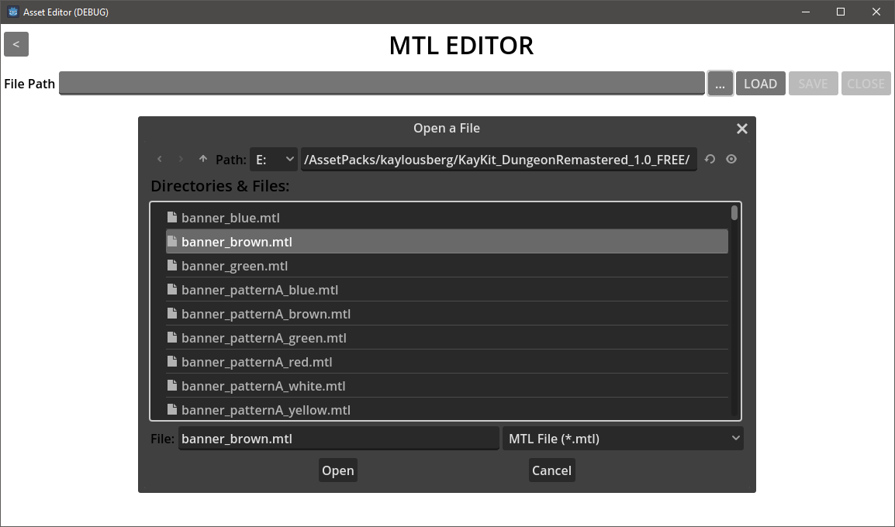
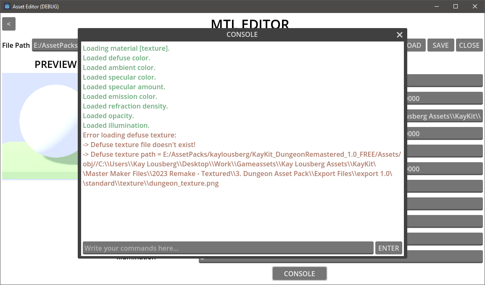
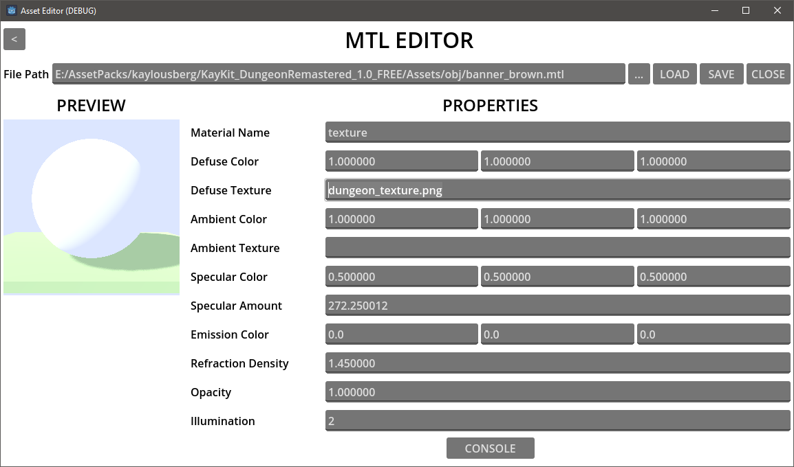
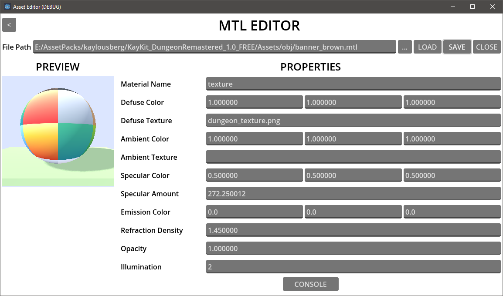

# Asset Editor

Allows for editing the properties of 3D asset files.

Currently supported asset formats: MTL.

## How To

➡ To edit .mtl [MTL] files we can open the MTL EDITOR.

➡ We can paste the .mtl file path we want to edit or browse to it using the **[...]** button.

➡ By pressing the **LOAD** button, all the materials in the mtl file are loaded and spawned in a list. (The example mtl file only contains one material)

➡ We can view each material in the preview section or have a look at its properties in the properties section.

➡ We can also open the Material Console by pressing the **CONSOLE** button to see the logs and errors for each material in the mtl file.

➡ We can change the values of the properties in the properties editor. (In this example we fix the absolute path to the diffuse texture file to relative path)

➡ After we are done with editing the properties of each material in the file, we can press the **SAVE** button to save the changes to the disk and update the preview.

## Credits

The mtl file shown in the How To tutorial above is from the free CC0 license version of [Kay's Dungeon Remastered 3D Asset Pack](https://kaylousberg.itch.io/kaykit-dungeon-remastered) 🙌

## Contribution

I highly appreciate any contribution you can give to the project and you can contribute by

➡ providing feedback 🕵️‍♂️

➡ catching the bugs 🐞

➡ starring the repo ⭐

➡ contributing to the code 👨‍💻

➡ funding the development 💖

## Contact

You can contact me by

➡ email at wamiqurrehman093@gmail.com

➡ joining the [discord server](https://discord.gg/xXMWeCNP5j)

➡ or by simply opening an issue in the issues tab